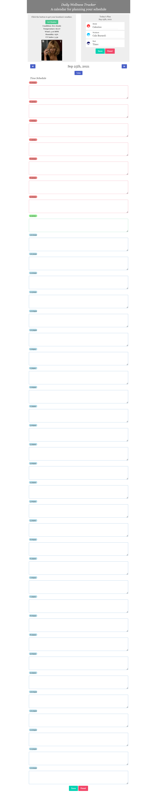

# daily-wellness-tracker

Made by:
* Mi Nguyen
* Max Willner
* Ben Yampolsky
* Cynthia Zaman

## Description 

The Daily Wellness Tracker is an app that allows users to create a daily and hourly tracker for their activities.

Source: [github repository](https://github.com/maxwillner/daily_wellness_tracker).

Deployed application: [the deployed application](https://byampols.github.io/daily_wellness_tracker/.

## Usage 

* When you open the tracker
  * Then you can choose to see today’s weather at your location
  * Then you see your plan for the day
* When you scroll down the page
  * Then you see a half-hourly breakdown of the day
  * Times in the past, present, and future are highlighted
* When you press save
  * Then all your changes are saved
* When you get discouraged and need some inspiration
  * Then you see a motivational gif at the top of the page
* When you navigate forward a day
  * Then you can enter tasks in the same manner as above, as well as view the forecasted weather
* When you navigate backwards
  * You can view the tasks already in place, and the weather will not show

## Credits

* [jQuery](https://jquery.com/)
* [Bootstrap](https://getbootstrap.com/)
* [Bulma](https://bulma.io/)
* [moment.js](https://momentjs.com/)
* [giphy api](https://developers.giphy.com/)
* [Openweather api](https://openweathermap.org)

## License

[Creative Commons License](LICENSE)
